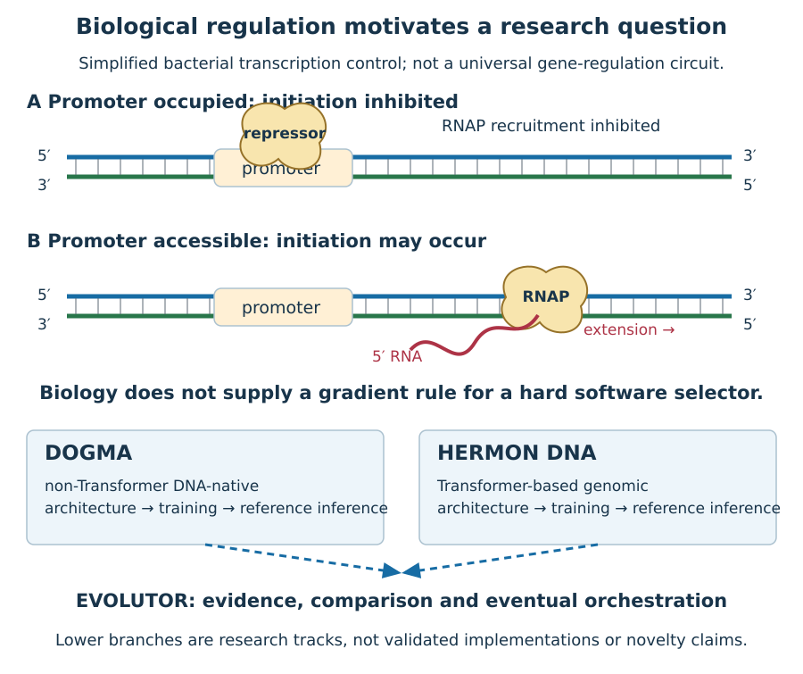

# Genomic-computation curriculum audit

2026-09-10. Starting commit 8ee4777976af0a68a01d2662cdd746ba0dfe49da; branch astra-deep-rewrite; clean worktree at entry.

## Decision

Keep 52 chapters in 12 parts. The existing outline already separates
foundations, DOGMA, Hermon DNA, training, distinct inference engines and Evolutor.
Do not adopt a larger candidate part count merely to look advanced. Preserve
accepted Chapters 1–2 and the eight-figure Chapter 3 working draft. The exact next
bounded chapter is Chapter 3, not Chapter 4.

The important repairs are genomic specificity and evidence: every borrowed mechanism needs a biological origin, a defined abstraction, a nearest baseline and a falsification test. Ordinary gates, recurrence, module cloning and DNA-trained models are not novel merely because they receive genomic names.

## Scope and research gates

Read the [detailed chapter map](DEEP_SCIENTIFIC_BOOK_ARCHITECTURE.md),
[migration decisions](DEEP_ARCHITECTURE_MIGRATION.md),
[visual map](SCIENTIFIC_VISUAL_MAP.md) and
[source ledger](../research/scientific-recalibration-sources.md).
The dependency files preserve actual canonical prerequisites, including Book I
imports in the detailed map. Every chapter keeps its existing mathematics,
exercise and keyframe sequence. All unbuilt entries remain plans.

DOGMA stays non-Transformer DNA-native; Hermon DNA stays Transformer-based. Each has an independent architecture → training → reference inference → specialized-engine track. Shared evaluation does not require identical state types or training algorithms. Unknown DOGMA state, operators and execution costs remain open rather than inferred from naming.

## Master map and scientific illustration policy

The [TXT source explanation](../research/figures/scientific-master.txt) names the
same objects and limits. Molecular backbones, base pairing, binding occupancy and
protein machinery are visually distinct. A strand is not a generic software box.
Conversely, a tensor operation is not decorated with a helix unless a molecular
abstraction is actually being tested. Master-map arrows show scope; chapter
keyframes explain detailed mechanisms. No animation video is claimed.

## Executable progression

Retain the shared benchmark/evaluation foundation and Chapter 3 tensor reference. Chapter 4 adds a reproducible PyTorch training lifecycle. DOGMA's minimal operator/model and Hermon DNA's baseline-plus-intervention follow only after their semantics are stable. Reference inference parity precedes profiling and specialized runtime work. A new compiler or training library requires demonstrated need.

## Skeptical author review

This is one author's multi-perspective review, not independent specialist approval.

- Scientific lens: distinguish established mechanisms from a schematic pathway and state omitted chemistry.
- Mathematical lens: define input size, quantifiers, shapes, denominators and discrete boundaries.
- Experimental lens: retain negative controls; no-signal and good-looking loss are not sufficient conclusions.
- Systems lens: own parameters, buffers, RNG and persistent state explicitly; count hidden work.
- Illustration lens: preserve identities across panels; avoid arrows through labels and misleading bonds.
- Novelty lens: prior art is a control, not an adversary; Caduceus/CrossDNA limit broad dual-strand novelty claims.
- Editorial lens: complete the current chapter before adding future manuscripts; independent review remains open.

## Handoff

Architecture refinement is a review map, not a new accepted edition. Continue one
bounded Chapter 3 in each book, preserve earlier PDF bytes, render all new pages
and record the remaining acceptance gates honestly. Local commits only; no push.

