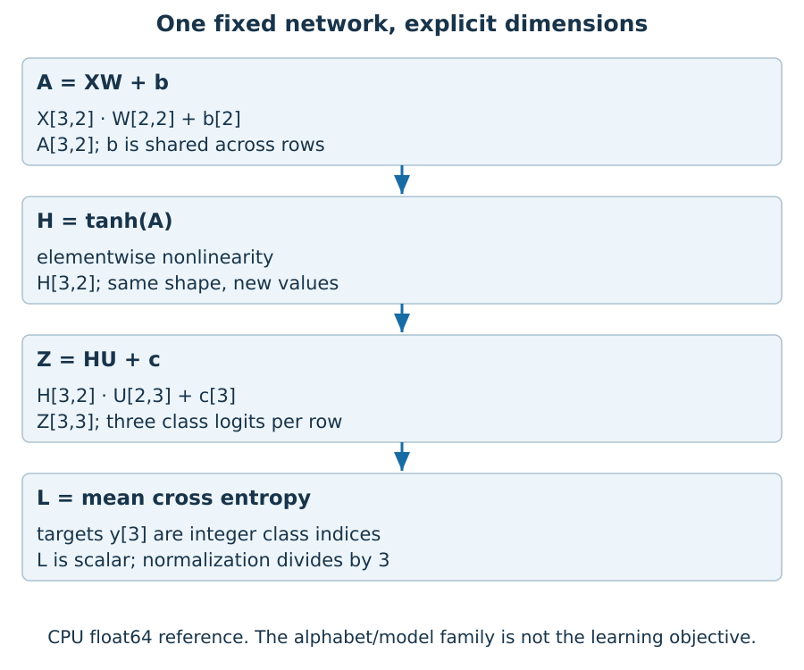
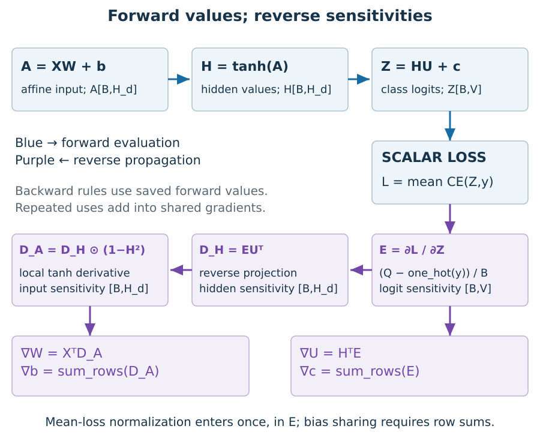
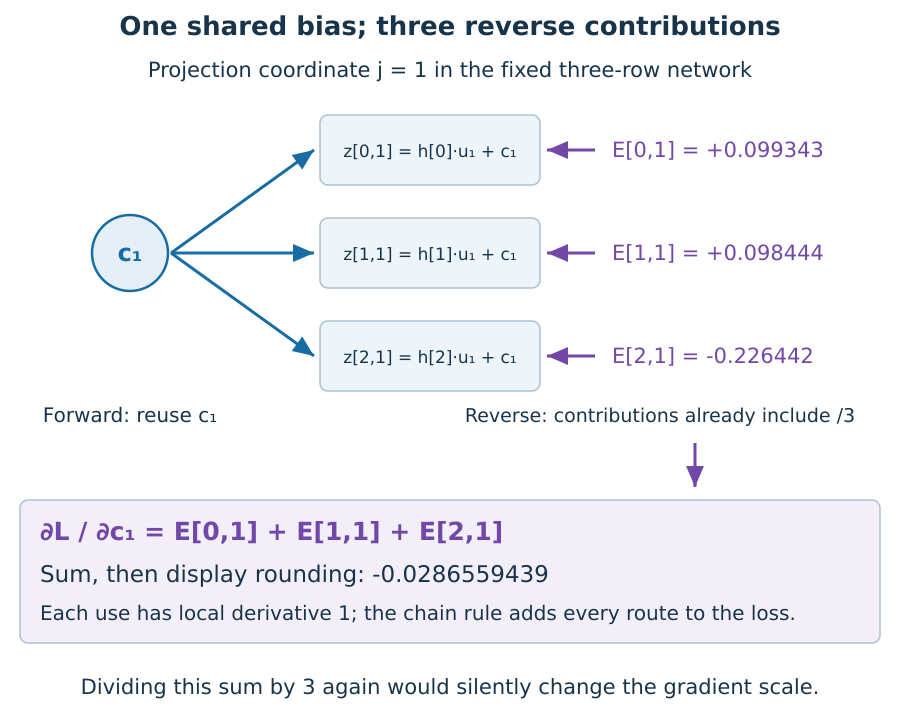
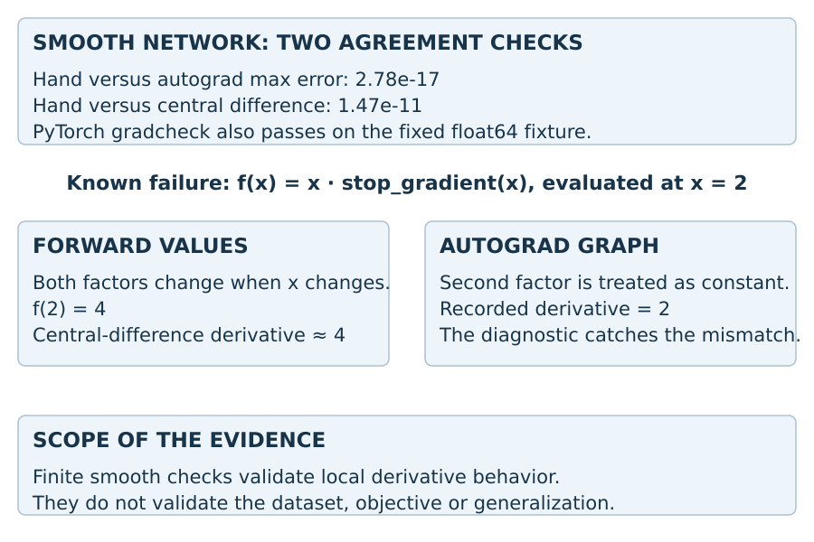
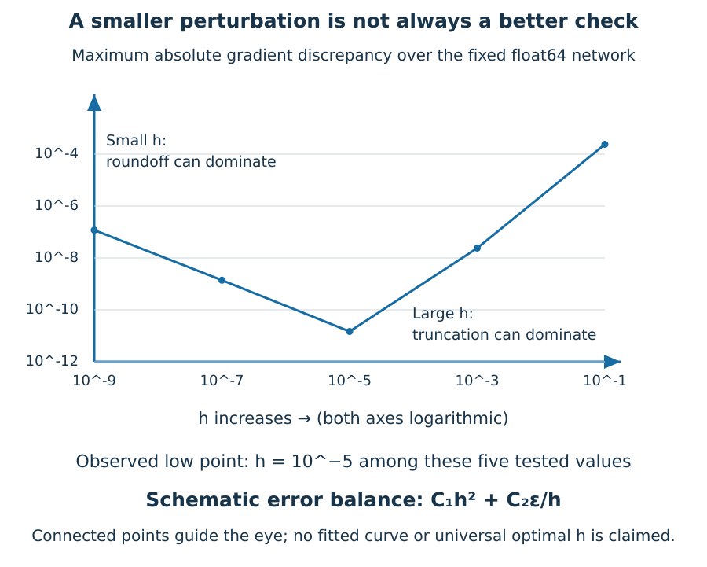
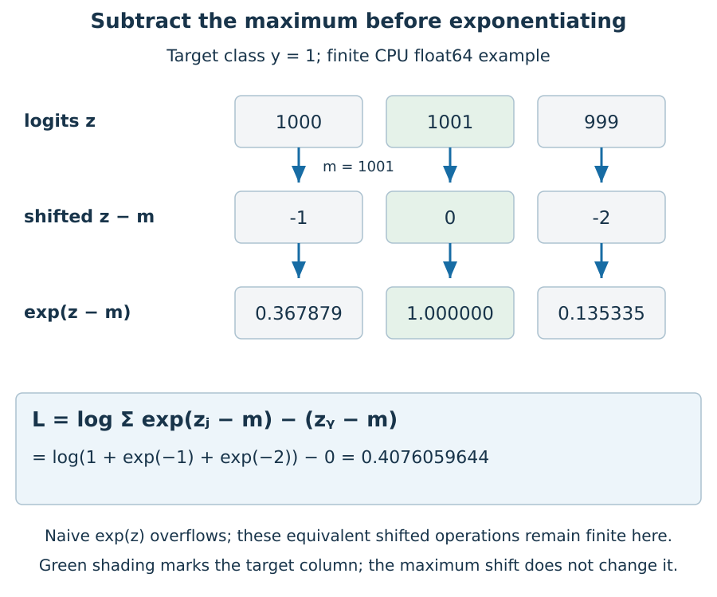
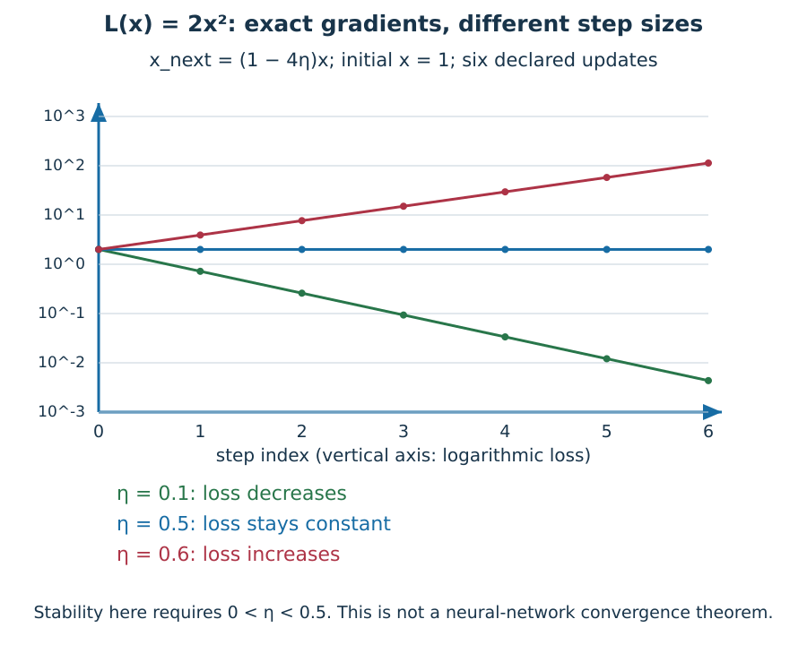
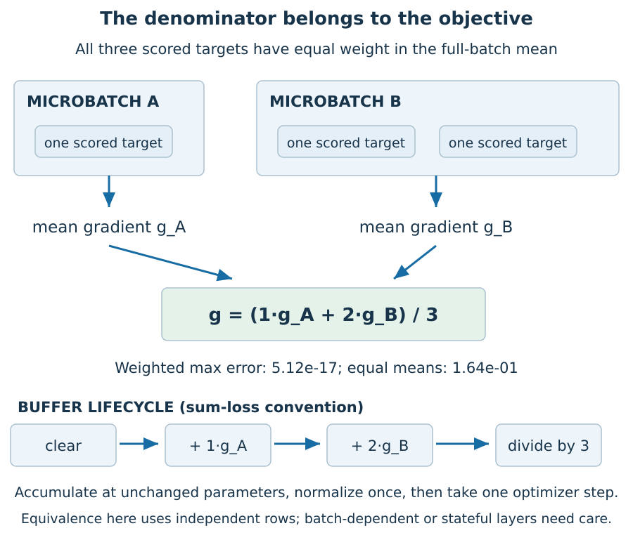

# Chapter 3. Differentiation, optimization and tensor programs

Working draft, 9 September 2026. This is an expanded technical core, not an accepted publication chapter. Chapters 1–2 remain the published build. Figure identifiers below belong to draft assets.

## 3.1 From a declared objective to a local change

Chapter 2 asked what information a model may use and what evidence its score supports. We now take the objective as declared and ask a narrower question: how does the implemented loss change when a parameter changes?

A gradient answers that local question. It does not certify a dataset split, prove that the loss measures the intended capability, or guarantee that the next optimization step improves held-out performance. A perfectly differentiated leaking model is still leaking. A perfectly differentiated wrong objective is still wrong.

We will use a small, smooth network with a fully specified numerical fixture. There is no DOGMA or Hermon architecture hidden behind the example. The point is to derive and test operations that later architectures must also implement correctly.

## 3.2 Read an equation as a tensor program

Let \(X\in\mathbb R^{B\times D}\) hold one input per row. Define

\[
A=XW+\mathbf1_B b^\top,\quad H=\tanh A,
\]
\[
Z=HU+\mathbf1_B c^\top,
\]

where \(W\in\mathbb R^{D\times H_d}\), \(b\in\mathbb R^{H_d}\), \(U\in\mathbb R^{H_d\times V}\), and \(c\in\mathbb R^V\). Here \(H_d\) denotes hidden width; the capital tensor \(H\) denotes hidden activations. The explicit outer products reveal the broadcast: the same bias contributes to every row.

The code writes `x @ w + b`, then `torch.tanh`, then `hidden @ u + c`. Broadcasting is convenient syntax, not a new mathematical rule. Each target \(y_i\) is an integer in \(\{0,\ldots,V-1\}\). The row logits \(Z_i\) parameterize a categorical distribution.

**EVOD-03-F1.** The fixed fixture uses \(B=3,D=2,H_d=2,V=3\). This is a generic three-class demonstration, not DNA-base prediction. The classification objective and the tensor shapes are explicit and independently checkable.

Our fixture is

\[
X=\begin{pmatrix}1&0\\0&1\\1&-1\end{pmatrix},\quad y=(0,2,1),
\]
\[
W=\begin{pmatrix}.2&-.1\\.4&.3\end{pmatrix},\quad b=(.05,-.02),
\]
\[
U=\begin{pmatrix}.3&-.2&.1\\-.4&.2&.5\end{pmatrix},\quad c=(.01,-.03,.02).
\]

Every reference tensor is CPU float64. That restriction makes the diagnostic contract narrow and repeatable; it is not a recommendation that all production training use float64.

## 3.3 Start the reverse pass at the loss

Let \(Q_{ij}=\exp Z_{ij}/\sum_k\exp Z_{ik}\). With no class weights or ignored labels, mean cross entropy is

\[
L=\frac1B\sum_i\left(\log\sum_j e^{Z_{ij}}-Z_{i,y_i}\right).
\]

For one row, differentiating the log-sum-exp gives \(Q_{ij}\); differentiating the selected target logit subtracts one exactly at the target class. Therefore

\[
E_{ij}:=\frac{\partial L}{\partial Z_{ij}}
=\frac{Q_{ij}-\mathbf1[j=y_i]}B.
\]

The division by \(B\) comes from the chosen mean objective. It does not belong to matrix multiplication, bias broadcasting, or the definition of a derivative. Moving that division carelessly between code components can change the effective update. PyTorch's [CrossEntropyLoss documentation](https://docs.pytorch.org/docs/2.10/generated/torch.nn.CrossEntropyLoss.html) specifies that its input is logits and details reductions and target conventions. Our hand derivation uses only the unweighted, fully scored case above.

A useful check follows immediately. Since each row of \(Q\) sums to one and each one-hot target does too, \(\sum_jE_{ij}=0\). Adding one common constant to every logit in a row does not change its predicted probabilities; the row gradient has no component in that invariant direction.

## 3.4 Derive each matrix gradient, including shared biases

For the projection \(Z=HU+\mathbf1c^\top\), its differential is

\[
dZ=(dH)U+H(dU)+\mathbf1(dc)^\top.
\]

Write the scalar loss differential as \(dL=\operatorname{tr}(E^\top dZ)\). Rearranging the three terms to pair each parameter differential with its coefficient gives

\[
\nabla_U L=H^\top E,\qquad
\nabla_c L=\sum_i E_i,\qquad
D_H:=\nabla_HL=EU^\top.
\]

Check dimensions: \(H^\top E\) has shape \(H_d\times V\), exactly the shape of \(U\). The sum over rows has length \(V\), exactly the shape of \(c\). If a proposed derivative has the wrong shape, it cannot be the derivative of that parameter under this convention. Correct shapes are necessary but not sufficient: a mistaken transpose can sometimes preserve dimensions when widths happen to match.

Because tanh acts elementwise,

\[
D_A=D_H\odot(1-H\odot H).
\]

Applying the same affine-layer argument at the input gives

\[
\nabla_WL=X^\top D_A,\qquad
\nabla_bL=\sum_i(D_A)_i.
\]

**EVOD-03-F2.** Bias gradients collect all uses of the shared parameter. Averaging these rows again would introduce an extra factor \(1/B\), because the mean-loss factor is already present in \(E\).

The function `manual_gradients` implements these equations without calling autograd. It reuses the numerical forward operations, so it is independent of the automatic reverse pass, not a completely independent implementation of every arithmetic operation. The zero-parameter fixture supplies an additional hand-computable check: with all targets in class zero, the output-bias gradient is \((-2/3,1/3,1/3)\), while the other parameter gradients vanish.

**EVOD-03-F5.** For output-bias coordinate \(c_1\), the three contributions are approximately \(+0.099343,+0.098444,-0.226442\). Summing the unrounded values gives approximately \(-0.0286559439\). The negative contribution outweighs the two positive contributions; the parameter has one gradient, not a separate update for each use.

The component calculation makes broadcasting concrete. Since \(z_{ij}=\sum_a H_{ia}U_{aj}+c_j\), we have \(\partial z_{ik}/\partial c_j=1\) when \(k=j\) and zero otherwise. Thus

\[
\frac{\partial L}{\partial c_j}
=\sum_{i,k}\frac{\partial L}{\partial z_{ik}}
             \frac{\partial z_{ik}}{\partial c_j}
=\sum_i E_{ij}.
\]

The sum is forced by parameter sharing. It is not a normalization choice. For this mean loss, every \(E_{ij}\) already contains the factor \(1/3\); dividing the bias sum by three again would shrink only that part of the update unless the same mistake were made elsewhere. A shape test would not catch this error because both a row sum and a row mean have the correct output shape.

## 3.5 What automatic differentiation computes

Automatic differentiation applies local derivative rules to the operations actually executed. Reverse mode propagates an output sensitivity backward; when multiple uses reach one value, their contributions are added. It need not construct the full Jacobian of a large scalar-loss program. Forward mode instead propagates an input direction. These modes compute products with a Jacobian or its transpose; their relative costs depend on the number and structure of inputs and outputs. [Baydin and colleagues' survey, Section 3](https://jmlr.org/papers/volume18/17-468/17-468.pdf), explains this distinction.

AD is not finite differencing. It does not estimate a derivative by subtracting two nearby function values. Nevertheless, its arithmetic is performed in finite precision, and its answer depends on the program's defined derivative semantics. An operation such as stop-gradient intentionally alters the derivative graph while leaving forward values unchanged.

PyTorch reconstructs its autograd graph as the forward program executes and may retain intermediate tensors for backward. Its [autograd mechanics documentation](https://docs.pytorch.org/docs/2.10/notes/autograd.html) also distinguishes differentiability, saved values and gradient recording modes. We use `torch.autograd.grad` on freshly cloned leaf parameters so the example returns gradient tensors without accumulating into an existing model's buffers.

This distinction matters for Evolutor's later structural ideas. Differentiating the continuous parameters of the selected branch is not the same as differentiating an arbitrary discrete decision that selected that branch. The existence of an autograd graph does not establish that an architecture-search or genome-editing operation has a useful continuous derivative.

## 3.6 Numerical checking needs a controlled function

For a scalar smooth function and coordinate direction \(e_k\), central differences estimate

\[
g_k(h)=\frac{L(\theta+he_k)-L(\theta-he_k)}{2h}.
\]

The companion perturbs one parameter entry at a time, clones the parameter collection, and evaluates the same fixed inputs and targets. This is intentionally slow and small. A gradient checker for a stateful or stochastic model would also need to control hidden state and randomness so both evaluations describe the same function. PyTorch's [gradcheck mechanics](https://docs.pytorch.org/docs/2.10/notes/gradcheck.html) describes numerical and analytical Jacobian comparisons.

At the printed fixture, the maximum absolute difference between hand gradients and autograd is about \(2.78\times10^{-17}\). With \(h=10^{-5}\), the hand-versus-central-difference error is about \(1.47\times10^{-11}\). The exact recorded values and parameter gradients are in [results.json](results.json). PyTorch's own gradcheck passes too.

These are absolute discrepancies at one fixed scale. A production check should state absolute and relative tolerances and examine near-zero components separately. Additional tests vary batch size, input dimension, hidden width and vocabulary so the matrices are not all square; a test performed only with equal widths could conceal a transpose error. Noncontiguous parameter views are tested too. Passing a derivative check also does not validate that an input/target shift matches Chapter 2's information contract.

## 3.7 The negative control: forward equality is not gradient equality

Consider a program whose forward expression is

\[
f(x)=x\cdot\operatorname{stop\_gradient}(x).
\]

When we vary the input and rerun it, its numerical values follow \(x^2\). Central differences near \(x=2\) therefore give approximately 4. But the recorded derivative graph treats the second factor as constant, producing derivative 2.

**EVOD-03-F3.** This is not evidence that autograd failed its contract: stop-gradient requested the altered derivative. It is evidence that the recorded gradient is not the derivative of the forward-value mapping under ordinary input perturbation. Whether that is a bug depends on the intended algorithm; the chapter's negative control makes the distinction observable.

The example guards against a weak testing habit: running a checker that has never detected any known failure. It also separates two tests from Chapter 2. A finite future-token intervention examines forbidden information flow. A finite parameter perturbation examines a derivative. Neither substitutes for the other.

## 3.8 Why a smaller difference step eventually gets worse

For a sufficiently smooth scalar function, Taylor expansion gives

\[
L(\theta+h)=L(\theta)+hL'(\theta)+\tfrac12h^2L''(\theta)
+\tfrac16h^3L'''(\theta)+O(h^4),
\]

and a corresponding expansion at \(-h\). Subtraction cancels the even terms; dividing by \(2h\) leaves a leading truncation error proportional to \(h^2\). Smaller \(h\) reduces that term.

But two close floating-point loss values are subtracted. If their absolute rounding errors are of scale \(\epsilon |L|\), dividing their difference by \(h\) gives an error contribution of order \(\epsilon |L|/h\). Thus the schematic competition is

\[
\text{error}(h)\approx C_1h^2+C_2\epsilon/h.
\]

This is a local error model with scale-dependent constants, not a universal fitted law. It explains why arbitrarily small perturbations can be worse. For our fixture, the recorded error falls from about \(2.39\times10^{-4}\) at \(h=.1\) to \(1.47\times10^{-11}\) at \(10^{-5}\), then rises to roughly \(1.18\times10^{-7}\) at \(10^{-9}\). No step size was tuned for model performance; these are derivative diagnostics.

**EVOD-03-F8.** Both axes are logarithmic. The points compare central differences with the hand-derived gradients over every parameter coordinate of the fixed network. The lines connect measured diagnostics, not samples from a fitted universal error law. The smallest error among these five choices occurs at \(h=10^{-5}\); that is not an optimal-step theorem.

The schematic balance can also suggest a scale, provided its assumptions hold. Differentiating \(C_1h^2+C_2\epsilon/h\) with respect to positive \(h\) gives \(2C_1h-C_2\epsilon/h^2\). Setting this to zero yields \(h^3=C_2\epsilon/(2C_1)\). This cube-root dependence explains why a useful difference step is generally much larger than machine epsilon. It cannot choose a universal number: the constants depend on local derivatives and the scale of the evaluated losses, and the model is not a bound on every floating-point computation.

## 3.9 Stable formulas still need finite inputs

For logits \((1000,1001,999)\), direct float64 exponentiation overflows. Yet the cross entropy for target class one is finite. Let \(m=\max_jz_j\) and rewrite it as

\[
\log\sum_j\exp(z_j-m)-(z_y-m).
\]

All exponent arguments are nonpositive, and at least one exponent is one. The companion's `stable_nll` gives approximately 0.4076059644, agreeing with PyTorch's cross entropy. Adding the same constant to all logits leaves the result unchanged in exact arithmetic; the tests check a finite shifted example and its gradients.

Floating-point operations are not generally associative, and mathematically equivalent batched and sliced computations need not be bitwise equal. PyTorch's [numerical-accuracy notes](https://docs.pytorch.org/docs/2.10/notes/numerical_accuracy.html) document such limitations. Our scalar cancellation example makes precision visible: \((10^8+1)-10^8\) evaluates to zero in float32 but one in float64. Using float64 improves this example; it does not eliminate numerical conditioning, overflow or all roundoff.

The stable-loss helper rejects nonfinite inputs rather than treating a nonfinite comparison as success. It is a compact reference for finite logits, not a replacement for the full production loss contract, masking rules or mixed-precision policy.

**EVOD-03-F6.** Subtracting 1001 maps the logits to \((-1,0,-2)\). Their exponentials sum to \(1+\exp(-1)+\exp(-2)\); the target's shifted logit is zero. The aligned columns make it possible to reconstruct the final loss without interpreting a decorative softmax icon.

The algebra follows by factoring out \(\exp(m)\) from the sum of exponentials:
\(\log\sum_j\exp(z_j)=m+\log\sum_j\exp(z_j-m)\).
The \(m\) term cancels when we subtract \(z_y\). Do not implement this proof by explicitly computing \(\exp(m)\): that would reintroduce the overflow the rearrangement avoids.

There is a derivative subtlety at tied maxima. The maximum alone is nonsmooth, but the exact composite loss remains smooth at finite tied logits. Write \(r_j=z_j-m\); the loss differential is \(\sum_j q_j(dz_j-dm)-(dz_y-dm)\). The coefficient of \(dm\) is \(1-\sum_jq_j=0\), leaving \(\sum_jq_jdz_j-dz_y\). The final gradient does not depend on which maximizer supplied the shift. A dedicated tied-logit test checks the implemented value and gradient against the same unshifted cross-entropy contract.

## 3.10 An exact gradient does not choose a safe step

Gradient descent updates \(x_{k+1}=x_k-\eta L'(x_k)\). Consider the fully analyzable scalar loss

\[
L(x)=\tfrac12\lambda x^2,\qquad\lambda>0.
\]

Since \(L'(x)=\lambda x\),

\[
x_k=(1-\eta\lambda)^k x_0.
\]

For a nonzero starting value, convergence to zero requires \(|1-\eta\lambda|<1\), or \(0<\eta<2/\lambda\). At \(\eta=2/\lambda\), the sign flips without shrinking. Above that boundary, the magnitude grows despite using the exact derivative at every step.

**EVOD-03-F4.** With \(\lambda=4\), learning rates .1, .5 and .6 respectively decrease, preserve and increase the loss magnitude sequence. The vertical axis is logarithmic so both decay and growth remain visible. These are analytic toy updates, not trained-model measurements.

For a positive-definite quadratic in several dimensions, orthogonal eigen-directions obey corresponding factors \(1-\eta\lambda_i\). A large eigenvalue restricts a shared stable step; a small eigenvalue can then decay slowly. This is the local geometry behind a simple conditioning difficulty. Nonlinear and stochastic objectives require additional assumptions and analysis.

The fixed network fixture takes one declared step with \(\eta=.1\): its loss decreases from approximately 1.0250007902 to 1.0179571386. That confirms this update's arithmetic and local effect only. It is not a training study or a generalization result. Optimizer state, momentum and other options add semantics beyond this plain update; see the official [SGD specification](https://docs.pytorch.org/docs/2.10/generated/torch.optim.SGD.html) before equating different implementations.

## 3.11 Accumulation must implement the declared objective

When multiple uses of a parameter contribute to one scalar loss, reverse differentiation sums their contributions. Separately, PyTorch's `.backward()` accumulates into leaf gradient buffers. In a small test, differentiating \(x^2\) at \(x=2\) twice on freshly constructed forward graphs gives a stored gradient of eight unless the buffer is cleared between calls. Setting the buffer to `None` restores the next isolated result of four.

Microbatch accumulation creates another normalization question. Split our three rows into one row and two rows. If each microbatch computes its own mean gradient \(g_1\) and \(g_2\), the full mean is \((g_1+2g_2)/3\), not \((g_1+g_2)/2\). The tests verify the weighted identity and require the incorrect unweighted version to disagree. For variable-length sequences, the relevant weights are the declared valid-target counts, not necessarily the number of sequences.

This is why a training loop is a tensor program implementing a statistical objective, not merely a repeated optimizer call. Chapter 4 must preserve those semantics across data loading, checkpointing and evaluation.

**EVOD-03-F7.** With the parameters held fixed, weighting the two mean gradients by target counts matches the full-batch gradient to approximately \(5.12\times10^{-17}\) maximum absolute error. Equal averaging instead differs by approximately \(0.164\). These figures come from the reference artifact; they diagnose objective weighting, not training quality.

More generally, let \(I_a\) partition the scored targets and \(N_a=|I_a|\), with \(N=\sum_a N_a>0\). Define \(L_a=N_a^{-1}\sum_{i\in I_a}\ell_i\). If the same per-target losses are evaluated at the same parameters in every partition, then

\[
L=\frac1N\sum_aN_aL_a,\qquad
\nabla L=\sum_a\frac{N_a}{N}\nabla L_a.
\]

There are two consistent implementations. Accumulate the gradients of each sum loss \(N_aL_a\), then divide the buffer by \(N\); or multiply each mean loss by \(N_a/N\) before backward. Do not combine both normalizations. Do not step the optimizer between microbatches if the intended update is the gradient of the original full-batch objective.

The premise about the *same* per-target losses matters. Batch-dependent operations, changing hidden state or different random draws can change the function when the batch is partitioned. In that case count weighting alone does not establish equivalence. Empty masked microbatches require special handling too: zero valid targets contribute a zero sum, but their mean is undefined. Our fixed reference has neither batch-dependent layers nor empty batches, so its weighted identity has a precisely declared scope.

## 3.12 Exercises with worked reasoning

1. **Bias reduction.** Why sum the per-row projection errors for \(\nabla_cL\)? **Solution:** The same scalar bias coordinate contributes with derivative one to that coordinate in every row. The chain rule adds these contributions. Mean-loss normalization already entered the row errors.
2. **A symmetry check.** Why must each row of the logit gradient sum to zero? **Solution:** Both its predicted distribution and one-hot target sum to one; their difference sums to zero. This agrees with invariance to adding a constant to all logits in that row.
3. **A detached factor.** Is the negative control proof of a library bug? **Solution:** No. Stop-gradient deliberately changes differentiation semantics. The mismatch shows that the recorded gradient does not equal the derivative of rerun forward values; whether that is wrong depends on the specified algorithm.
4. **Stability boundary.** For \(L(x)=3x^2\), what positive rates converge from nonzero \(x_0\)? **Solution:** Here \(\lambda=6\), so the multiplicative factor is \(1-6\eta\). Its magnitude is below one exactly for \(0<\eta<1/3\). Equality at \(1/3\) gives undamped sign flips.
5. **Unequal batches.** Ten scored targets give mean gradient \(a\), and ninety give mean gradient \(b\). What is the combined mean? **Solution:** \((10a+90b)/100\). Equal averaging assigns ten times too much relative weight to each target in the smaller batch.
6. **A passing derivative check.** Does passing gradcheck establish that a genomic model is causal or scientifically useful? **Solution:** No. A function can have perfectly correct derivatives while reading forbidden future tokens or optimizing a shortcut. Parameter-derivative correctness, information access and empirical evidence are separate obligations.

7. **Broadcast bug with correct shape.** A reverse pass uses the row mean of \(E\) for the output bias. Why can all shape assertions pass while the update is wrong? **Solution:** Both the sum and mean produce a vector of vocabulary width. The mean introduces an extra factor \(1/B\), despite \(E\) already representing the mean-loss sensitivity. Check values against a nonzero analytical fixture, not just dimensions.
8. **Maximum-shift algebra.** Why is calculating \(\exp(m)\) unnecessary? **Solution:** Factoring it out gives \(m+\log\sum_j\exp(z_j-m)-z_y\). Combining the two scalar terms yields the stable expression directly. Constructing the factored exponential numerically defeats the algebraic cancellation.
9. **Tied logits.** For one target in class 1 and logits \((0,0,0)\), what are the loss and gradient? **Solution:** The loss is \(\log 3\), and the gradient is \((1/3,-2/3,1/3)\). A tied maximum in the stable intermediate does not make the final cross entropy nonsmooth; the maximum's differential cancels.
10. **Perturbation scale.** Minimize the schematic positive error \(ah^2+b\epsilon/h\) for positive \(a,b,\epsilon\). **Solution:** Setting its derivative to zero gives \(h=(b\epsilon/(2a))^{1/3}\). The second derivative is positive. The result depends on unknown local constants and should motivate a diagnostic scan, not a universal checker default.
11. **Two equivalent accumulation loops.** Show why backpropagating \((N_a/N)L_a\) per microbatch matches accumulating \(N_aL_a\) and dividing once. **Solution:** Differentiation and finite summation are linear at fixed parameters. Both yield \(\sum_a(N_a/N)\nabla L_a\). Applying both methods' divisions produces an erroneous extra \(1/N\). Updating parameters between terms breaks the fixed-parameter premise.
12. **Design a boundary test.** Does a passing microbatch check cover a layer whose output subtracts the current batch mean? **Solution:** No. Partitioning changes the batch mean, so a row's output and loss can change. Compare the per-row forward values first; if they differ, the two programs need not compute the same objective. Separate a weighting bug from a legitimate batch-dependent computation.

## Publication work still required

Complete the remaining four storyboard figures, expand optimizer-state and nonsmooth/discrete semantics with directly verified primary sources, add stateful derivative cases, and integrate the LaTeX apparatus. Twelve exercises now have worked reasoning; scientific, mathematical and rendered-page review must still precede activation in the published book. DOGMA remains the non-Transformer DNA-native model/engine line; Hermon DNA remains Transformer-based; Evolutor is the broader framework. None is trained or benchmarked by this draft.
